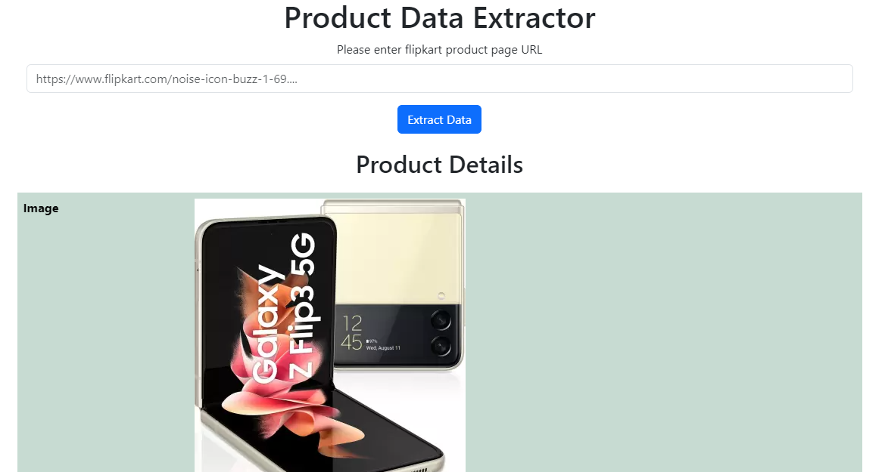

# web-scrapping
This project demonstrates a simple web scraping application using Python's Flask framework, BeautifulSoup for parsing HTML, and requests for making HTTP requests.

The application allows users to input a URL of a product page from Flipkart and retrieves various details such as product image, title, prices, description, highlights, rating, reviews, and offers.

## Key Features:
URL Input: Users can input the URL of a Flipkart product page.
Data Extraction: The application extracts relevant data using BeautifulSoup from the HTML content of the provided URL.
Error Handling: Provides error handling for invalid URLs or failed HTTP requests.
Display: Renders the extracted data on a web page using Flask's templating system.

## Technologies Used:
Flask: Micro web framework for Python.
BeautifulSoup: Python library for parsing HTML and XML documents.
requests: HTTP library for making requests in Python.

## Note:
This project is for showcases how web scraping can be implemented using Python. It's important to respect the terms of service of websites and obtain proper permissions before scraping any data.

